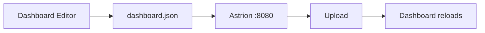

# Getting Started with Astrion Custom Dashboard

This guide walks through the first-time setup of **Astrion Custom Dashboard** on a **Sanytron Astrion HA100** remote, from enabling ADB to connecting Home Assistant and loading your first dashboard.

It is intended for users starting from the stock Astrion software.

> **What this guide covers**
>
> - Enabling Developer options and USB debugging
> - Installing Astrion Custom Dashboard with ADB
> - Selecting Astrion Custom as the launcher
> - Granting the required Android permissions
> - Connecting the remote to Home Assistant
> - Creating and uploading your first `dashboard.json`
> - Updating the app later without ADB
> - Recovering or returning to the stock launcher

## Table of contents

1. [Before you start](#1-before-you-start)
2. [Install Android Platform Tools](#2-install-android-platform-tools)
3. [Enable Developer options on the Astrion](#3-enable-developer-options-on-the-astrion)
4. [Connect the remote with ADB](#4-connect-the-remote-with-adb)
5. [Install Astrion Custom Dashboard](#5-install-astrion-custom-dashboard)
6. [Restart the Astrion](#6-restart-the-astrion)
7. [Select Astrion Custom as the launcher](#7-select-astrion-custom-as-the-launcher)
8. [Grant storage access](#8-grant-storage-access)
9. [Allow Astrion Custom to modify system settings](#9-allow-astrion-custom-to-modify-system-settings)
10. [Find the remote IP address](#10-find-the-remote-ip-address)
11. [Connect Home Assistant](#11-connect-home-assistant)
12. [Check the Home Assistant connection](#12-check-the-home-assistant-connection)
13. [Create your first dashboard](#13-create-your-first-dashboard)
14. [Upload dashboard.json to the Astrion](#14-upload-dashboardjson-to-the-astrion)
15. [Back up the current dashboard](#15-back-up-the-current-dashboard)
16. [Upload custom icons](#16-upload-custom-icons)
17. [Physical buttons](#17-physical-buttons)
18. [Updating Astrion Custom Dashboard](#18-updating-astrion-custom-dashboard)
19. [Returning to the stock Astrion launcher](#19-returning-to-the-stock-astrion-launcher)
20. [Troubleshooting](#20-troubleshooting)
21. [Recommended first setup workflow](#21-recommended-first-setup-workflow)
22. [Useful links](#22-useful-links)

---

## 1. Before you start

You will need:

- A Sanytron Astrion HA100 connected to Wi-Fi
- A computer on the same network as the remote
- A USB cable for the initial installation
- Android Platform Tools (`adb`) installed on your computer
- The latest Astrion Custom Dashboard APK
- The URL of your Home Assistant instance
- A Home Assistant Long-Lived Access Token

You only need ADB for the initial installation and recovery. Once Astrion Custom Dashboard is running, normal configuration and updates can be done from its built-in web interface.

### Download the APK

Download the latest release from:

<https://github.com/dckiller51/astrion-custom-dashboard/releases>

Save the APK somewhere easy to access from your terminal.

---

## 2. Install Android Platform Tools

If `adb` is not already installed, download **Android SDK Platform Tools** from Google:

<https://developer.android.com/tools/releases/platform-tools>

Extract the archive.

### Windows example

Open PowerShell in the extracted `platform-tools` folder:

```powershell
cd C:\platform-tools
```

Verify that ADB works:

```powershell
.\adb.exe version
```

### macOS / Linux

```bash
./adb version
```

or, if `adb` is already in your `PATH`:

```bash
adb version
```

---

## 3. Enable Developer options on the Astrion

On the remote:

1. Open **Android Settings**.
2. Go to **About device**.
3. Find **Build number**.
4. Tap it repeatedly until Android confirms that Developer options have been enabled.
5. Go back to Settings.
6. Open **Developer options**.
7. Enable **USB debugging**.

The exact menu labels can vary slightly depending on the Astrion firmware.

---

## 4. Connect the remote with ADB

The **first ADB connection must be made over USB**.

On the Astrion HA100, the USB connector is hidden under the charging socket cover on the bottom of the remote. To access it:

1. Remove the remote from the charging dock.
2. Locate the cover around the charging socket.
3. Unscrew the **two small screws** that hold the cover in place.
4. Carefully remove the cover to expose the USB connector.
5. Connect the Astrion to your computer with a **data-capable USB cable**.

> Keep the two screws and the cover in a safe place so you can reinstall them after the initial setup.

Once the USB cable is connected, run:

```bash
adb devices
```

The first time, the remote should show a USB debugging authorization dialog. Approve it, then run the command again:

```bash
adb devices
```

You should see the Astrion listed with the status:

```text
device
```

### If ADB shows `unauthorized`

1. Unlock the remote.
2. Look for the USB debugging authorization dialog.
3. Approve the computer.
4. Run `adb devices` again.

If the dialog does not appear, disconnect and reconnect the USB cable and try again.

---

## 5. Install Astrion Custom Dashboard

Install the APK:

```bash
adb install <path-to-apk>
```

Example on Windows:

```powershell
.\adb.exe install .\app-debug.apk
```

A successful install normally ends with:

```text
Success
```

> If Android reports a signature conflict with a previously installed development build, uninstall the old package first:
>
> ```bash
> adb uninstall com.custom.astrion
> ```
>
> Then install the APK again.

---

## 6. Restart the Astrion

After installation, **fully reboot the remote** — simply closing and reopening the app is not enough.

A full reboot is important because some permissions and the Android launcher registration only take full effect after the device restarts.

---

## 7. Select Astrion Custom as the launcher

After reboot, Android should ask which Home / launcher application to use.

Select **Astrion Custom**.

If Android offers the choice between **Just once** and **Always**, choose **Always** if you want Astrion Custom Dashboard to be the normal remote interface.

After this, Astrion Custom replaces the original **HaRemote** launcher.

---

## 8. Grant storage access

On first launch, grant the requested storage permission.

Astrion Custom uses storage for:

```text
/sdcard/astrion/dashboard.json
/sdcard/astrion/icons/
```

The dashboard configuration and custom icons are stored there.

---

## 9. Allow Astrion Custom to modify system settings

From the Astrion Custom dashboard:

1. Swipe down from the top of the screen — the Astrion Custom **Settings** panel opens.
2. Above the brightness slider, tap **Allow modification**.
3. Android opens the system permission screen.
4. Select **Astrion Custom** and allow modification of system settings.
5. Return to Astrion Custom.

This permission is used for features such as display brightness control.

---

## 10. Find the remote IP address

The local configuration server runs directly on the remote, at:

```text
http://<remote-ip>:8080
```

The current address is shown in the Astrion Custom Settings panel, for example:

```text
http://192.168.1.50:8080
```

Open that address from a browser on a computer, phone, or tablet connected to the same local network.

---

## 11. Connect Home Assistant

Open the Astrion configuration page:

```text
http://<remote-ip>:8080
```

Enter:

- Your **Home Assistant URL**
- Your **Home Assistant Long-Lived Access Token**
- Optional Harmony Hub settings, if you use Harmony

Example local Home Assistant URL:

```text
http://192.168.1.10:8123
```

or your normal HTTPS Home Assistant URL.

### Create a Home Assistant Long-Lived Access Token

In Home Assistant, open your user profile / security settings and create a **Long-Lived Access Token**.

Give it a recognizable name, for example:

```text
Astrion Bedroom
```

Copy the token immediately and paste it into the Astrion configuration page.

> Treat this token like a password. Do not publish it or place it in `dashboard.json`.

Save the connection settings. Astrion Custom restarts automatically so it can reconnect using the new settings.

---

## 12. Check the Home Assistant connection

Swipe down from the top of the Astrion screen to open the Settings panel, and check the Home Assistant connection status.

If it is not connected, verify:

- The Home Assistant URL
- The token
- That the Astrion can reach Home Assistant over the network
- That HTTP/HTTPS is correct
- That DNS works, if you used a hostname instead of an IP address

For the first test, using a local Home Assistant IP address can make troubleshooting easier.

---

## 13. Create your first dashboard

You can build `dashboard.json` manually, but the easiest starting point is the online editor:

<https://dckiller51.github.io/astrion-custom-dashboard/>

The editor lets you create pages, cards, and hotkeys without writing the whole JSON by hand.

For a first test, keep the dashboard simple. A good first dashboard is one page with one Home Assistant entity — for example a light, media player, or switch.

This makes it easy to confirm that the Home Assistant connection and dashboard loading both work before building a larger remote configuration.

When finished, export/download the generated `dashboard.json`.

---

## 14. Upload `dashboard.json` to the Astrion

Return to `http://<remote-ip>:8080` and upload your new `dashboard.json`.

The dashboard reloads without requiring a new APK installation. This is the normal workflow when editing the remote:



No ADB is required.

---

## 15. Back up the current dashboard

Before making major changes, download the current `dashboard.json` from the Astrion configuration page.

A simple backup naming scheme is useful:

```text
dashboard-bedroom-2026-08-22.json
dashboard-bedroom-before-activities.json
dashboard-bedroom-working.json
```

If an edit breaks the dashboard, upload the last working file again.

---

## 16. Upload custom icons

Custom icons are stored in:

```text
/sdcard/astrion/icons/
```

You do not need ADB to add them — use the local Astrion configuration page at `http://<remote-ip>:8080` to upload PNG icons, then reference those icons from your dashboard configuration.

---

## 17. Physical buttons

Astrion Custom can map the HA100 physical buttons through dashboard hotkeys.

Typical uses include:

- Page navigation
- Back / Home
- Media transport
- Volume actions
- Application-specific commands
- Quick Home Assistant actions

It is usually easiest to first make the touchscreen dashboard work correctly, then configure physical-key behavior.

---

## 18. Updating Astrion Custom Dashboard

After the first installation, ADB is normally no longer needed for application updates.

Open `http://<remote-ip>:8080` and use the update function to check GitHub Releases. When a newer release is available, the remote can download the APK and launch the Android installer.

### First update only

Android may ask you to allow **Install unknown apps** for Astrion Custom. Grant the permission, return to the configuration page, and start the update again.

After that, future updates normally require only a few taps.

---

## 19. Returning to the stock Astrion launcher

If you want to remove Astrion Custom completely:

```bash
adb uninstall com.custom.astrion
```

The remote will fall back to the original **HaRemote** launcher.

---

## 20. Troubleshooting

### `adb devices` shows no device

Check:

- USB debugging is enabled
- The USB cable supports data, not only charging
- The remote is unlocked
- The USB debugging authorization dialog has been accepted

Then reconnect the cable and run `adb devices` again.

### `adb devices` shows `unauthorized`

Approve the USB debugging prompt on the Astrion and retry. If necessary:

```bash
adb kill-server
adb start-server
adb devices
```

### APK installation fails because of a signature conflict

Remove the previous Astrion Custom build:

```bash
adb uninstall com.custom.astrion
```

Then install the new APK.

> Back up your dashboard first if you have already configured the remote.

### Android did not ask which launcher to use

Reboot the remote once more. If Android still opens another launcher, open Android Settings, check the default Home application settings, and select **Astrion Custom**.

Menu names can vary by firmware.

### Home Assistant stays disconnected

Check the URL and token first, and confirm that the remote can reach Home Assistant from the same network.

If you are using a hostname, try the local IP address temporarily, for example:

```text
http://192.168.1.10:8123
```

If the IP works but the hostname does not, the problem is likely network/DNS related rather than Astrion Custom itself.

### Dashboard does not load after uploading JSON

Restore the last known working `dashboard.json`. The online editor is the safest way to generate a valid starting configuration.

When making larger changes, save working versions frequently.

---

## 21. Recommended first setup workflow

For a new remote, the safest sequence is:

1. Install Astrion Custom
2. Reboot
3. Select Astrion Custom launcher
4. Grant permissions
5. Connect Home Assistant
6. Load a minimal dashboard
7. Test one HA entity
8. Add more pages/cards
9. Configure physical buttons
10. Build Activities and advanced AV logic

Do not start by recreating your entire universal remote configuration. First confirm that the basic path works:

```text
Astrion → Home Assistant → device
```

Then add complexity step by step.

---

## 22. Useful links

- Project: <https://github.com/dckiller51/astrion-custom-dashboard>
- Latest releases: <https://github.com/dckiller51/astrion-custom-dashboard/releases>
- Online dashboard editor: <https://dckiller51.github.io/astrion-custom-dashboard/>
- Android Platform Tools: <https://developer.android.com/tools/releases/platform-tools>
- Home Assistant: <https://www.home-assistant.io/>

---

## Next steps

Once the first dashboard is working, you can continue with:

- Multiple pages
- Home Assistant cards
- Media-player controls
- Physical hotkeys
- Custom icons
- Activities
- Camera cards
- Vacuum cards
- Harmony integration, if needed

At that point, the local `:8080` configuration page and the online dashboard editor should be enough for normal day-to-day maintenance without ADB.
